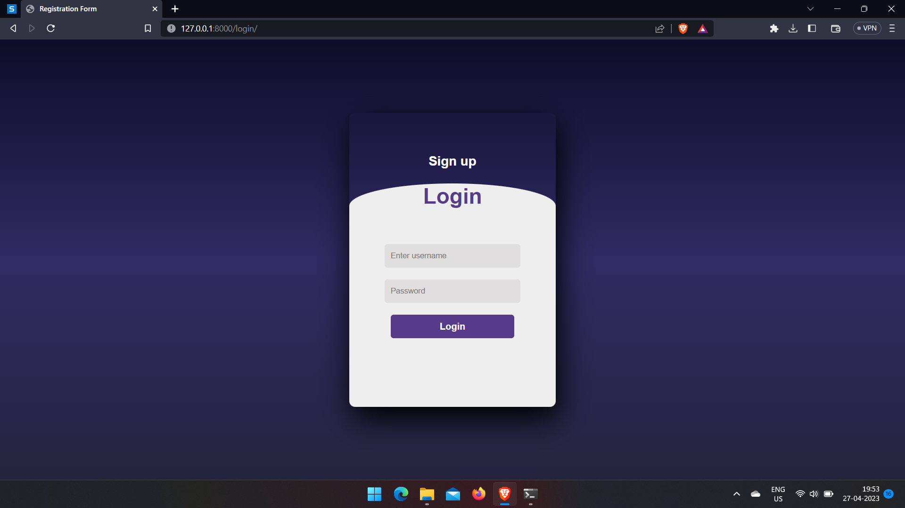
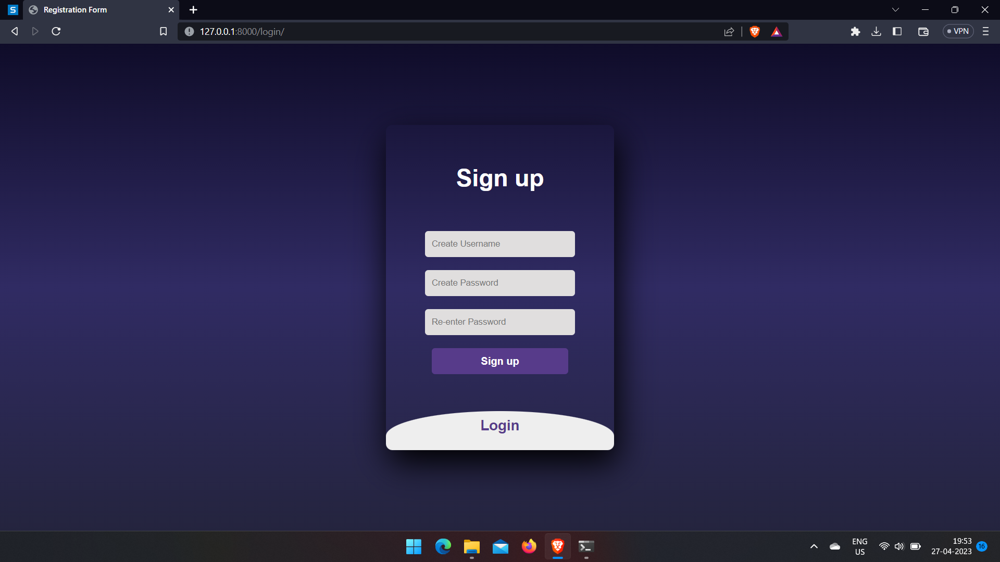
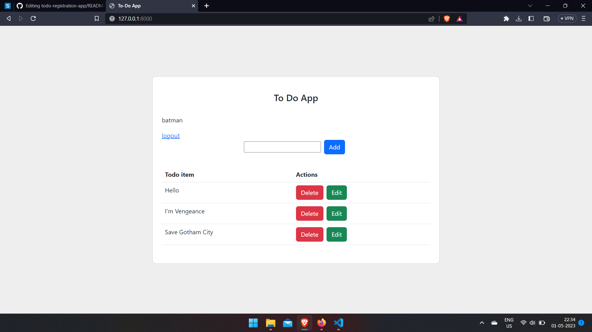

# todo-registration-app

**Live link :- https://todo-app-lpmr.onrender.com**

**Run command in shell/teminal**
> python manage.py runserver

* Each user will have there own todo list.
* Authentication and security is maintained using authentication module.
* Integrated data from different back-end services and databases.

              

 
